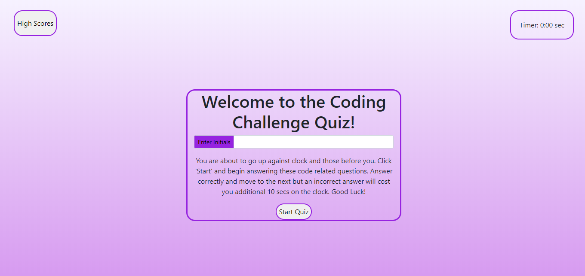
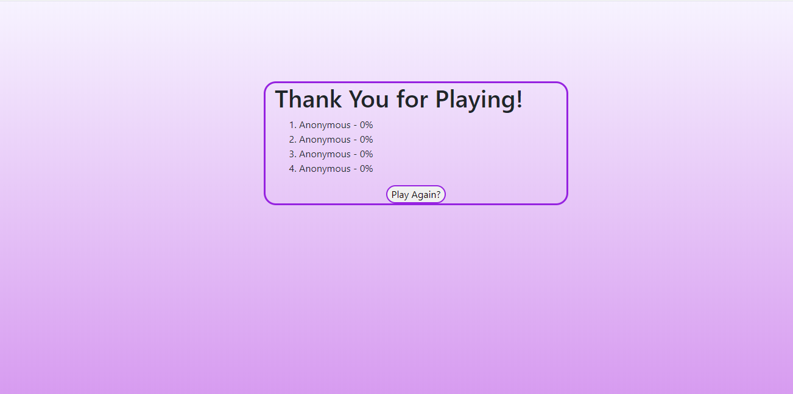
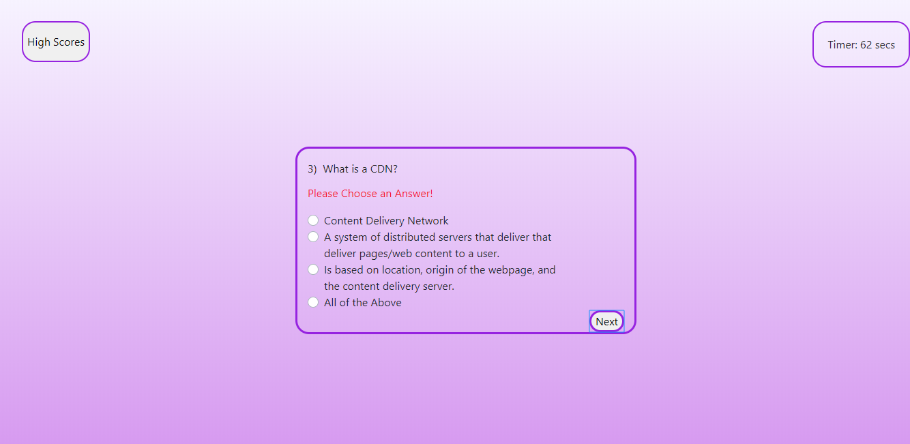

# KCQuizMe
## Coding Quiz Challenge

**Description:**

An example of a coding assessment with an timer.  As a student, it allows me to test my knowledge and gauge my progress against that of my peers.  This application challenges the user to answer and answer correctly as wrong answers not only cost them in overall score, it will cost them in a time deduction of seconds left to play.  The following conditions were met:

1. Timer - set at 0 sec triggered with 80 sec to play 
2. 5 Questions to Answer
3. 10-second Deduction for any/every wrong response
4. Message triggered with no response on answer 
5. Player Initials tracked along with score %.  If no Initials entered "Anonymous" populates.
6. Each players info logged to High score page based on rating High -> Low.

**Usage:**
Companies often utilize assessments of various natures to determine qualities and attributes of potential candidates that they may want or that they may feel will be a good match with their current environment.

### File List:

1. Index.html
    
     Main Page - Greeting with Start button and Timer.  Also has link to High Score page.

2. Quiz.js    
    
     Javascript for Main Page 

3. Highscore.html      

     Highscore Page

4. Hs.js 

     Javascript for Highscore Page

5. Style.css         

     Stylesheet for all

6. Reset.css

     Compressed set of CSS rules that resets the styling of all HTML elements to a consistent baseline.

### Link to site

https://karna1014.github.io/KCQuizMe/.

### Index Page

### High Score Page

### No Response Triggered Message

